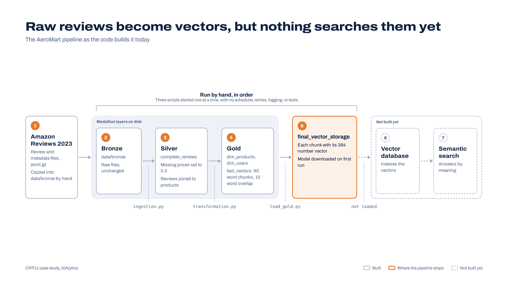

# AeroMart Semantic Search: Reviewing an On-Premise Vector Pipeline with GitHub Copilot

A self-directed 10Alytics data engineering case study. You are not building this pipeline, and you will not run it. You are reviewing it, the way a senior engineer reviews code they have just inherited.

Explore the pipeline interactively: [AeroMart pipeline explorer](https://illustrated-learning-de.vercel.app/smenatics/index.html)

## The scenario

AeroMart Inc. is a global e-commerce company whose keyword search cannot understand what customers mean. An internal team built a first version of a pipeline that turns product reviews into vector embeddings for semantic search. It must run on AeroMart's own servers, with no cloud compute.

The pipeline has never been reviewed. Before AeroMart invests further, it wants to know what is wrong with it, what to fix first, and how it should be documented.

## Your mission

Review the code with GitHub Copilot as your assistant, and deliver:

1. A map of how the pipeline works.
2. An audit of every problem you can find, with evidence.
3. Proposed code improvements for the most important problems.
4. A data quality plan.
5. Complete documentation for the repository.

You do **not** need Spark, Java, or Docker installed. Every finding must be backed by evidence you can point to in the code: a file name and a line number.

## How this project works

This project is self-directed. You plan your own time, make your own decisions, and justify them in writing.

- **Every milestone has a "Done when" check.** Use it to decide for yourself whether you are finished.
- **When you are stuck,** work through this order: re-read the checklist item, look at the stage in the pipeline explorer, ask Copilot one focused question, then ask in the cohort channel.
- **Your instructor reviews your work at three checkpoints** (listed under Milestones) and reads your Copilot log along the way.

## Setting up

1. Install [VS Code](https://code.visualstudio.com/), the Python extension, and [Git](https://git-scm.com/downloads).
2. Sign in to VS Code with your GitHub account and turn on GitHub Copilot. The Copilot Free plan includes 2,000 code completions and 50 chat requests per month. If you are a verified student, you may qualify for Copilot Pro at no cost through GitHub Education.
3. **Fork this repository.** Click **Fork** at the top of this page and choose your own account as the owner. You now have your own copy at `github.com/<your-username>/Building-A-Semantic-Vector-Database-`.
4. **Clone your fork, not the original:**
   ```bash
   git clone https://github.com/<your-username>/Building-A-Semantic-Vector-Database-.git
   cd Building-A-Semantic-Vector-Database-
   ```
5. **Create a branch for your work:**
   ```bash
   git checkout -b review/<your-name>
   ```
6. Open the folder in VS Code. Your written work goes in the `deliverables/` folder, where a template is waiting for each milestone.

### Plan your Copilot chats

Fifty chat requests is not many for a whole project. Budget about ten per milestone. Write focused questions that include the relevant file as context, and put the answer to work before asking another question.

## Rules for working with Copilot

1. **Copilot is a reviewer, not an authority.** It can be confidently wrong about Spark behaviour. Check every claim against the code and the [PySpark documentation](https://spark.apache.org/docs/latest/api/python/).
2. **Never commit code you cannot explain line by line** without Copilot open.
3. **Log your prompts.** Keep `deliverables/COPILOT_LOG.md` up to date with each useful prompt, a short summary of the answer, and whether it was right, partly right, or wrong, with your reason.
4. **Think like an on-premise company.** Copilot sends your code to a cloud service. This repository is public training material, so that is fine here. At a company like AeroMart, you would check policy before sending private code or data to any AI service. Mention this in your report.

Useful Copilot features: Copilot Chat with a file added as context, the `/explain` and `/doc` commands, and inline chat on a selected block of code.

## The pipeline at a glance



| File | What it is meant to do |
| --- | --- |
| `ingestion.py` | Reads review and metadata files from Bronze, keeps selected columns, fills missing prices, drops null review text, joins reviews to products on `parent_asin`, and writes Silver. |
| `transformation.py` | Builds `dim_products`, `dim_users`, and `fact_vectors`, where each review is split into 60 word chunks with a 10 word overlap. |
| `load_gold.py` | Encodes every chunk with the `all-MiniLM-L6-v2` model (384 dimensions) and writes `final_vector_storage` as Parquet. |
| `demo.ipynb` | Exploratory notebook that runs the same logic on a 200 row sample. |
| `requirements.txt` | Python dependencies. |
| `Dockerfile` | **Out of scope.** Ignore it for this project. |


## Know the data

The input is the [Amazon Reviews 2023](https://amazon-reviews-2023.github.io/) dataset from McAuley Lab. You do not need to download it. Read the dataset page, especially the sample records and the **Data Fields** tables, and keep them open while you review. Many problems only become visible when you compare what the code assumes with what the data actually contains.

Things worth knowing before you start:

- Review files and metadata files are separate, and they are linked by `parent_asin`, not `asin`.
- Reviews include fields the pipeline does not keep, such as the review `title`, `verified_purchase`, and `helpful_vote`.
- Some products have no metadata, and some metadata has no price.
- Timestamps are Unix time in milliseconds.

## What to look out for

This is the complete checklist. For every item, decide whether it is a real problem, find the exact lines, rate the severity, and explain the impact on AeroMart. Some items will turn out to be less serious than they look, and saying so with evidence counts as a finding too.

### A. Correctness

| ID | Where | What to look for |
| --- | --- | --- |
| A-1 | `transformation.py`, end of file | A log message that reports the wrong table and the wrong meaning for its count. |
| A-2 | `transformation.py`, `recursive_chunker` | Whether the function does what its name says. Compare it with the commented-out version above it. |
| A-3 | `transformation.py`, `recursive_chunker` | A `try` and `except` that returns an empty list. What errors would disappear silently? |
| A-4 | `load_gold.py`, `get_embedding` | What is returned for empty text, and whether every row ends up with a 384 number vector. |
| A-5 | `ingestion.py`, metadata step | `drop_duplicates` on `parent_asin`. Which row is kept when a product appears twice, and is that choice deterministic? |
| A-6 | `ingestion.py` and `transformation.py` | Paths written as `./data/...` in some places and `data/...` in others. What happens if a script is started from a different folder? |
| A-7 | `demo.ipynb` | `spark.stop()` called before later cells use the session. Can the notebook run from top to bottom? |
| A-8 | `demo.ipynb` | `.limit(200)` applied to reviews and metadata separately. How many of those 200 reviews are likely to find their product in the join? |

### B. Spark performance

| ID | Where | What to look for |
| --- | --- | --- |
| B-1 | `load_gold.py` | The model is created on the driver and used inside a row-at-a-time Python UDF. How many times is the model sent or loaded, and how many rows does each call encode? Research `pandas_udf`. |
| B-2 | `transformation.py` | Chunking runs in a plain Python UDF. What is the cost of moving every row between the JVM and Python? |
| B-3 | All three scripts | `.count()` called inside print statements and after writes. Each count is an action. How many times is each DataFrame computed from scratch? |
| B-4 | `transformation.py`, `fact_vectors` | `repartition(20)` followed by `coalesce(1)` before writing. What does each one do, and do they work against each other? |
| B-5 | All writes | `coalesce(1)` everywhere. What happens to parallelism and file size when the data grows tenfold? |
| B-6 | Session builder in all three scripts | `spark.driver.memory` and `spark.executor.memory` set while running `local[*]`. Which of these settings actually take effect in local mode? |
| B-7 | Session builder | `spark.sql.shuffle.partitions` fixed at 20. How would you choose this number? |
| B-8 | `ingestion.py`, both reads | No explicit schema. What does schema inference cost on large files, and what happens if a field changes type? |
| B-9 | All scripts | No `cache()` or `persist()` on DataFrames that are used more than once. Where would caching help, and where would it waste memory? |

### C. Data quality

| ID | Where | What to look for |
| --- | --- | --- |
| C-1 | `ingestion.py` | Missing prices replaced with `0.0`. Is an unknown price the same as a free product? What would a price filter in search return? |
| C-2 | `ingestion.py`, the join | An inner join with no record of how many reviews were dropped. Who would notice if half the data disappeared? |
| C-3 | `ingestion.py`, review step | Only null text is removed. What about empty strings, whitespace, one-word reviews, and exact duplicates? |
| C-4 | Review text throughout | Text goes to the chunker and the model exactly as it arrives. Look at real reviews on the dataset page: what markup, line breaks, or encoding problems might appear? |
| C-5 | `transformation.py`, `recursive_chunker` | Reviews under 10 characters return no chunks at all. Is losing every short review acceptable? |
| C-6 | `ingestion.py`, review step | `timestamp` kept as Unix milliseconds. What type should a review date be in Gold? |
| C-7 | `fact_vectors` | No chunk ID and no review ID. Can a search result be traced back to the exact review it came from? |
| C-8 | Columns dropped in `ingestion.py` | `verified_purchase`, `helpful_vote`, and the review `title` are discarded. Would any of them improve search quality or trust? |
| C-9 | Review text | Reviews can contain personal details such as email addresses or phone numbers. Should those end up in a searchable index? |
| C-10 | Between every layer | No checks at all. What must be true about Silver before Gold is built? |
| C-11 | Project brief versus code | The data dictionary in the brief and the code disagree in places, for example `title` versus `product_name`. Which is the source of truth? |

### D. On-premise readiness

| ID | Where | What to look for |
| --- | --- | --- |
| D-1 | `load_gold.py` | `SentenceTransformer('all-MiniLM-L6-v2')` downloads the model from the internet on first use. What happens on an AeroMart server with no internet access? |
| D-2 | `load_gold.py` and the README | The pipeline ends at a Parquet file. There is no vector database and no search. Document the gap and what would be needed to close it. |
| D-3 | Bronze layer | Data is copied into `data/bronze` by hand, and `data/` is ignored by Git. How would a new teammate get exactly the same input files? |
| D-4 | The three scripts | They must be run by hand, in the right order, with nothing to stop a later step if an earlier one fails. |
| D-5 | `load_gold.py` | Whether the vectors are normalized, and which similarity measure a future vector database should use with them. |

### E. Code quality and maintainability

| ID | Where | What to look for |
| --- | --- | --- |
| E-1 | All three scripts | The same Spark session configuration copied three times. |
| E-2 | All three scripts | Code runs at import time, with no functions and no `if __name__ == "__main__":` block. Can any part be tested on its own? |
| E-3 | All three scripts | `print` instead of logging, and no error handling. |
| E-4 | All three scripts | `spark.stop()` is never called. |
| E-5 | `transformation.py` | Unused imports and a large block of commented-out code. |
| E-6 | `requirements.txt` | No version pins, `pyspark` and `torch` missing, and a package that is never used. Could someone reproduce this environment in six months? |
| E-7 | `load_gold.py` | Typos in comments and numbered comments that start at 3. Small things, but they signal how carefully the code was reviewed. |
| E-8 | `.gitignore` | It lists itself, and it ignores a `.dockerignore` file that is not in the repository. |
| E-9 | Whole repository | No tests. What is the smallest test that would have caught a broken join? |

### F. Documentation

| ID | Where | What to look for |
| --- | --- | --- |
| F-1 | `README.md` | Below the student notice, the original README is one paragraph, with no setup steps, architecture, or data description. |
| F-2 | All functions | No docstrings. |
| F-3 | Whole repository | No data dictionary that matches the code. |
| F-4 | Whole repository | No explanation of the design decisions, such as why 60 words, why 10 words of overlap, and why this model. |

## Milestones

Each milestone ends with a "Done when" check. Checkpoints are where your instructor reviews your work.

### 1. Map the pipeline

Use Copilot to explain each script, then check its explanation against the code. Fill in `README.md` A short paragraph per script, covering its inputs, outputs, and every column it creates or drops.

**Done when:** every output path and every column in the code appears in your map, and your Copilot log shows at least one explanation you corrected or confirmed with evidence.

### 2. Audit the code (Checkpoint 1)

Fill in `README.md`. For every checklist ID, give a status (Confirmed or Not an issue), the file and line numbers, a severity (High, Medium, or Low), and the impact on AeroMart. Add any problems you found that are not on the list.

**Done when:** every ID has a status and evidence, and the report opens with your top five problems in priority order.

### 3. Propose improvements

On your branch, rewrite the code to fix your top five problems, with Copilot's help. Reference the finding ID in every commit message. Fill in `README.md`, explaining for each change what it fixes and why you expect it to be faster or more reliable, in Spark terms.

**Done when:** each change maps to a finding ID, and you can explain every changed line without Copilot.

### 4. Plan for data quality (Checkpoint 2)

Fill at least eight checks across Silver and Gold. For each one, state the rule, the layer, what it catches, and what should happen to rows that fail. You may ask Copilot to draft the checks as PySpark code, but you must review them.

**Done when:** every finding in section C is covered by at least one check.

### 5. Document everything (Checkpoint 3)

Rewrite `README.md`, replacing both the student notice and the original paragraph (cover purpose, architecture, setup on a machine that has Spark, how to run, and known limitations) so it matches your improved code, and add a docstring to every function. Use `/doc` for first drafts, then edit them yourself. Add to your documentation a short reflection on where Copilot helped and where it misled you.

**Done when:** someone who has never seen this repository could understand what it does, how to run it, and what is still missing, from the documentation alone.


Never open a pull request against the original repository. Your work stays in your fork.

| Checkpoint | Submit after | What is reviewed |
| --- | --- | --- |
| 1 | Milestone 2 | `ARCHITECTURE.md` and `AUDIT_REPORT.md` |
| 2 | Milestone 4 | Your code changes, `OPTIMIZATION_PLAN.md`, and `DATA_QUALITY.md` |
| 3 | Milestone 5 | `README.md`, `DATA_DICTIONARY.md`, docstrings, and `COPILOT_LOG.md` |

## How your work is assessed

- **Evidence.** Every finding points to specific lines.
- **Judgement.** Your priorities make sense for AeroMart, and you catch Copilot's mistakes rather than repeat them.
- **Improvements.** Your proposed changes fix what they claim to fix, and you can explain them.
- **Data quality thinking.** Your checks would catch real problems without silently losing data.
- **Documentation.** A newcomer can understand the repository from your documents alone.


## Data credit

Hou, Y., Li, J., He, Z., Yan, A., Chen, X., and McAuley, J. (2024). *Bridging Language and Items for Retrieval and Recommendation.* arXiv:2403.03952.